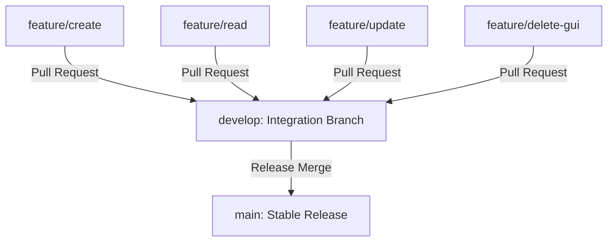

# KasirQu - Desktop Cashier & Point of Sale (POS) System

KasirQu is a Java-native Desktop Cashier / Point of Sale (POS) application designed for fast, modular, and collaborative development. This project serves as a university final project (tugas akhir mata kuliah Pemrograman Lanjut) engineered to balance academic requirements with collaborative industry-standard software engineering practices.

> [!IMPORTANT]
> **Active development does not happen on the `main` branch.** 
> The `main` branch represents the stable production-ready baseline. All active collaborative development, integration, and feature staging occur on the `develop` branch and respective isolated `feature/*` branches.

---

## 🚀 Quick Start for Collaborators

To ensure a smooth onboarding process and prevent branching issues, please follow the steps below to set up your local workspace.

### Option A: Clone the `develop` branch directly (Recommended)
This method clones only the active development branch, saving git overhead:
```bash
git clone -b develop https://github.com/FarrelPandhita/PEMLAN-KasirQu.git
cd PEMLAN-KasirQu
```

### Option B: Standard clone and switch
If you perform a standard clone, you must manually switch to the `develop` branch before writing any code:
```bash
git clone https://github.com/FarrelPandhita/PEMLAN-KasirQu.git
cd PEMLAN-KasirQu
git checkout develop
```

---

## 🌳 Branch Navigation Guide

Our repository uses a flat, low-friction branching model designed to isolate task ownership and avoid Git merge conflicts.



### Branch Responsibilities

| Branch | Developer / Role | Target Directory & Scope |
| :--- | :--- | :--- |
| `main` | Technical Lead | Stable production base. **No direct commits allowed.** |
| `develop` | All Collaborators | Primary integration environment. All feature branches merge here. |
| `feature/create` | CREATE Developer | `services/create/`, `repositories/create/` (Add Product, Create Transaction) |
| `feature/read` | READ Developer | `services/read/`, `repositories/read/` (View Products, Search, History, Pagination) |
| `feature/update` | UPDATE Developer | `services/update/`, `repositories/update/` (Update Details, Stock mutation, Cart state) |
| `feature/delete-gui` | DELETE & GUI Developer | `services/delete/`, `repositories/delete/`, and `gui/` (Delete Product, UI views) |

---

## 🔄 Daily Sync Workflow (Preventing Merge Conflicts)

Because we use a **Hybrid Architecture** where each developer owns isolated files (e.g., `CreateInventoryService.java` vs `ReadInventoryService.java`), merge conflicts are naturally minimized. However, you must still maintain git discipline.

Follow this workflow **every day** before you write a single line of code:

```bash
# 1. Switch to develop and pull the latest changes
git checkout develop
git pull origin develop

# 2. Switch back to your personal feature branch
git checkout feature/create

# 3. Merge develop into your feature branch to keep it synchronized
git merge develop
```

*By merging `develop` into your feature branch daily, you resolve potential conflicts locally and incrementally, ensuring your Pull Request back to `develop` is clean and mergeable.*

---

## 🏗️ Repository Structure Summary

Our Maven project structure keeps data layers, services, facades, and views strictly decoupled.

```text
KasirQu/
├── docs/                                 # Detailed engineering guidelines (Source of Truth)
├── database/                             # Database schema and SQL migrations
│   ├── masterDB.sql                      # Single source of truth for the local database
│   └── migrations/                       # Incremental database changes
├── src/main/java/com/kasirqu/
│   ├── config/                           # DB configuration and .env loading
│   ├── database/                         # Database Connection helper (Singleton)
│   ├── models/                           # POJOs mapping directly to database tables
│   ├── contracts/                        # Frozen Interfaces defining service boundaries
│   ├── services/                         # Isolated CRUD business logic
│   │   ├── create/, read/, update/, delete/
│   ├── repositories/                     # Isolated SQL execution
│   │   ├── create/, read/, update/, delete/
│   ├── facade/                           # Coordinators orchestrating services for GUI
│   ├── gui/                              # Presentation layer (Java Swing pages)
│   └── Main.java                         # Main application entry point
├── .env.example                          # Database configuration template
├── pom.xml                               # Maven project configuration
└── CONTRIBUTING.md                       # Strict contribution rules
```

---

## 🛠️ Tech Stack & Environment Support

*   **Core**: Java Native (JDK 17+)
*   **Build Tool**: Maven (Dependencies managed via `pom.xml`)
*   **Database**: MySQL Server (MySQL Connector/J)
*   **User Interface**: Java Swing (GUI is tentative / designed with NetBeans Matisse)
*   **Primary IDE**: Apache NetBeans 16+
*   **Alternative IDEs**: fully compatible with IntelliJ IDEA and Visual Studio Code

---

## 🛑 Strict Development Rules

1.  **NO Monolithic Classes**: Under no circumstances should you create a generic `ProductService.java`. You must put your logic inside your assigned CRUD folder (e.g. `CreateInventoryService.java`).
2.  **NO Direct GUI to DB Connections**: The GUI must only interact with `Facade` classes (`InventoryFacade`, `CartFacade`, `TransactionFacade`). Direct SQL queries inside Swing components are strictly prohibited.
3.  **DO NOT Edit Other Developers' Folders**: If you are the `feature/create` developer, do not make changes in `services/read/` to fix a bug. Request the change from the owner.
4.  **No Credentials in Git**: Never commit a `.env` file containing passwords. Use the `.env.example` as a local guide.
5.  **Contract Freeze**: Do not change method signatures in `contracts/` without a full team vote.

---

## 📖 Essential Documentation
Before starting, navigate to the `docs/` folder to read the detailed development manuals:
- [System Architecture](docs/architecture.md) - Deep dive into Facades and unidirectional data flow.
- [Database & Environment](docs/database-architecture.md) - Understanding SQL tables and `.env` strategy.
- [Merge & Collaboration Strategy](docs/merge-strategy.md) - PR rules and conflict resolution.
- [Coding Standards](docs/coding-standards.md) - Class naming, variable rules, and anti-patterns.
- [Onboarding NetBeans Setup](docs/setup-netbeans.md) - Matisse tips for the UI developer.
- [Onboarding IntelliJ & VSCode Setup](docs/setup-intellij.md) - Setup for non-NetBeans IDEs.

## 🤝 Getting Help
If you encounter any compiler errors, database connectivity issues, or Git merge errors:
1. Read the [Troubleshooting Guide](docs/troubleshooting.md).
2. Read the [AI Agent Rules](docs/ai-agent-rules.md) if you are working with an AI assistant.
3. Consult the Technical Lead or Git Maintainer.

---
*KasirQu is designed and maintained by your university PEMLAN team. Let's build a clean, stable codebase!*
