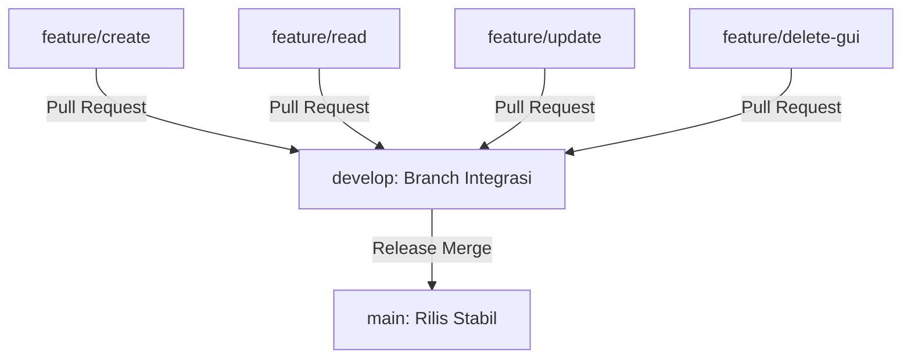

# KasirQu - Desktop Cashier & Point of Sale (POS) System

KasirQu adalah aplikasi Desktop Cashier / Point of Sale (POS) berbasis Java Native yang dirancang untuk pengembangan kolaboratif, modular, dan cepat. Proyek ini merupakan tugas akhir untuk mata kuliah Pemrograman Lanjut yang dirancang khusus untuk menyeimbangkan kebutuhan akademik dengan praktik rekayasa perangkat lunak standar industri.

> [!IMPORTANT]
> **Pengembangan aktif tidak dilakukan di branch `main`.**
> Branch `main` hanya representasi dari versi stabil yang siap rilis dan panduan onboarding. Seluruh proses kolaborasi, integrasi fitur, dan staging dilakukan di branch `develop` dan branch fitur `feature/*` masing-masing developer.

---

## Panduan Memulai untuk Kolaborator

Untuk memastikan proses onboarding berjalan lancar dan menghindari masalah percabangan Git, silakan ikuti langkah-langkah di bawah ini untuk menyiapkan ruang kerja lokal Anda.

### Opsi A: Kloning Branch `develop` Secara Langsung (Direkomendasikan)
Metode ini hanya mengkloning branch pengembangan aktif, sehingga menghemat beban overhead repositori:
```bash
git clone -b develop https://github.com/FarrelPandhita/PEMLAN-KasirQu.git
cd PEMLAN-KasirQu
```

### Opsi B: Kloning Standar dan Ganti Branch
Jika Anda melakukan kloning standar, Anda wajib berpindah ke branch `develop` secara manual sebelum menulis kode:
```bash
git clone https://github.com/FarrelPandhita/PEMLAN-KasirQu.git
cd PEMLAN-KasirQu
git checkout develop
```

---

## Panduan Navigasi Branch

Proyek ini menggunakan model percabangan flat untuk mengisolasi kepemilikan tugas dan menghindari konflik penggabungan kode (merge conflict).



### Tanggung Jawab Branch

| Branch | Developer / Peran | Direktori Target & Ruang Lingkup |
| :--- | :--- | :--- |
| `main` | Technical Lead | Versi produksi stabil. **Dilarang melakukan commit langsung.** |
| `develop` | Semua Kolaborator | Branch integrasi utama. Semua fitur wajib digabungkan di sini. |
| `feature/create` | CREATE Developer | `services/create/`, `repositories/create/` (Tambah Produk, Buat Transaksi) |
| `feature/read` | READ Developer | `services/read/`, `repositories/read/` (Lihat Produk, Cari, Riwayat, Pagiasi) |
| `feature/update` | UPDATE Developer | `services/update/`, `repositories/update/` (Ubah Detail, Mutasi Stok, State Keranjang) |
| `feature/delete-gui` | DELETE & GUI Developer | `services/delete/`, `repositories/delete/`, dan `gui/` (Hapus Produk, Integrasi UI) |

---

## Alur Kerja Sinkronisasi Harian (Menghindari Merge Conflict)

Karena proyek ini menggunakan arsitektur hibrida dengan isolasi kepemilikan file (misalnya, `CreateInventoryService.java` tidak menyatu dengan `ReadInventoryService.java`), konflik penggabungan kode dapat diminimalkan. Meskipun demikian, disiplin Git tetap wajib diterapkan.

Jalankan alur kerja berikut setiap hari sebelum Anda menulis kode:

```bash
# 1. Pindah ke branch develop dan tarik perubahan terbaru dari remote
git checkout develop
git pull origin develop

# 2. Pindah kembali ke branch fitur pribadi Anda
git checkout feature/create

# 3. Gabungkan branch develop ke dalam branch fitur Anda agar tetap sinkron
git merge develop
```

Dengan menggabungkan branch `develop` ke branch fitur secara berkala, Anda dapat mendeteksi dan menyelesaikan potensi konflik secara lokal dan bertahap. Hal ini menjamin proses Pull Request kembali ke `develop` berjalan lancar.

---

## Ringkasan Struktur Repositori

Struktur proyek Maven memisahkan layer data, layanan bisnis, fasad, dan presentasi secara ketat.

```text
KasirQu/
├── docs/                                 # Dokumen panduan rekayasa terperinci (Source of Truth)
├── database/                             # Skema database dan migrasi SQL
│   ├── masterDB.sql                      # Single source of truth untuk database lokal
│   └── migrations/                       # Perubahan database secara bertahap
├── src/main/java/com/kasirqu/
│   ├── config/                           # Konfigurasi database dan pemuatan .env
│   ├── database/                         # Helper Koneksi Database (Singleton)
│   ├── models/                           # POJO yang memetakan langsung ke tabel database
│   ├── contracts/                        # Interfaces yang membatasi fungsi layanan bisnis
│   ├── services/                         # Logika bisnis CRUD yang terisolasi
│   │   ├── create/, read/, update/, delete/
│   ├── repositories/                     # Eksekusi SQL yang terisolasi
│   │   ├── create/, read/, update/, delete/
│   ├── facade/                           # Koordinator yang menyatukan layanan untuk GUI
│   ├── gui/                              # Layer presentasi (halaman Java Swing)
│   └── Main.java                         # Entry point utama aplikasi
├── .env.example                          # Template konfigurasi database lokal
├── pom.xml                               # Konfigurasi proyek Maven
└── CONTRIBUTING.md                       # Aturan ketat kontribusi kode
```

---

## Teknologi & Dukungan Lingkungan Kerja

*   **Inti**: Java Native (JDK 17+)
*   **Build Tool**: Maven (Dependensi dikelola melalui `pom.xml`)
*   **Database**: MySQL Server (MySQL Connector/J)
*   **User Interface**: Java Swing (GUI dirancang menggunakan NetBeans Matisse)
*   **IDE Utama**: Apache NetBeans 16+
*   **IDE Alternatif**: Kompatibel penuh dengan IntelliJ IDEA dan Visual Studio Code

---

## Aturan Ketat Pengembangan

1.  **Dilarang Membuat Kelas Monolitik**: Jangan membuat kelas layanan umum seperti `ProductService.java`. Semua logika wajib diletakkan di dalam folder CRUD masing-masing (misalnya, `CreateInventoryService.java`).
2.  **Dilarang Menghubungkan GUI Langsung ke DB**: Komponen GUI hanya boleh berinteraksi dengan kelas `Facade` (`InventoryFacade`, `CartFacade`, `TransactionFacade`). Eksekusi query SQL langsung di dalam kelas Swing dilarang keras.
3.  **Dilarang Mengubah File Kepemilikan Anggota Lain**: Jika Anda memegang peran `feature/create`, Anda dilarang mengubah file di dalam `services/read/` untuk memperbaiki bug. Laporkan masalah tersebut ke pemilik branch terkait.
4.  **Dilarang Melakukan Commit Kredensial**: Jangan pernah mengunggah file `.env` yang berisi kata sandi database Anda ke Git. Gunakan `.env.example` sebagai panduan lokal.
5.  **Pembekuan Kontrak**: Dilarang mengubah tanda tangan metode (*method signature*) pada folder `contracts/` tanpa persetujuan seluruh anggota tim.

---

## Dokumentasi Penting
Sebelum memulai coding, luangkan waktu untuk membaca panduan pengembangan terperinci di dalam folder `docs/`:
- [Arsitektur Sistem](docs/architecture.md) - Penjelasan mendalam mengenai Facade dan aliran data satu arah.
- [Database & Lingkungan Kerja](docs/database-architecture.md) - Memahami tabel SQL dan strategi penggunaan `.env`.
- [Strategi Penggabungan & Kolaborasi](docs/merge-strategy.md) - Aturan Pull Request dan resolusi konflik.
- [Standar Kode](docs/coding-standards.md) - Aturan penamaan kelas, variabel, dan pola anti-pattern.
- [Panduan Setup NetBeans](docs/setup-netbeans.md) - Tips Matisse untuk pengembang antarmuka.
- [Panduan Setup IntelliJ & VSCode](docs/setup-intellij.md) - Konfigurasi untuk lingkungan selain NetBeans.

## Layanan Bantuan
Jika Anda mengalami kendala kompilasi, kegagalan koneksi database, atau masalah penggabungan kode:
1. Baca [Panduan Pemecahan Masalah](docs/troubleshooting.md).
2. Baca [Aturan AI Agent](docs/ai-agent-rules.md) jika Anda bekerja menggunakan asisten AI.
3. Hubungi Technical Lead atau Git Maintainer tim Anda.

---
*KasirQu dirancang dan dikelola oleh tim Pemrograman Lanjut. Mari kita bangun basis kode yang bersih dan stabil!*
